# Payload

## Overview

- Category: Malware Analysis
- Difficulty: Easy
- Author: megachar0x01
- Completion Date: July 14th, 2026 
- Tags: Ghidra, IDA, x64dbg, PEBear, PEStudio, malware, shellcode

## Scenario

> You’ve completed Training Day — congrats, rookie. Now the real game begins. An unmarked binary just landed on your desk. It’s acting shady, tripping a few alarms, but no one's sure what it really is. Malware? Or just a misunderstood piece of code? Your mission: reverse-engineer the program, trace its behavior, and uncover the truth. Every line of code could be a clue—or a trap. Welcome to your first real case.

## Analysis Environment

All of the tasks in this challenge were completed on a Flare VM environment with host-only adapter network settings. The PE file given to us injects shellcode into a process and executes it, so it's important to analyze in a controlled setting. I used a few standard tools that come pre-packaged with Flare VM such as PEBear, Ghidra, and x64dbg.

## Tasks

1. What is the SHA256 hash of func_pointer.exe?

To get the SHA256 hash of the PE file, I used the following PowerShell command:
```Get-FileHash ./func_pointer.exe -Algorithm SHA256```

> [+] Answer: EDD41B4A819F917F81203424730AAF0C24CC95E40ACFC0F1BD90B11DADF58015

2. What compiler is being used?

In PEBear (you could also use an alternative such as PEStudio) my first thought was to check the rich header, but there wasn't one. This tells me that Microsoft dev tools were not used. Digging further, I navigated to the strings section and found MinGW repeated many times.

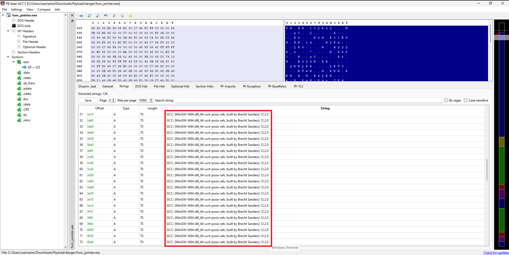

> [+] Answer: MinGW

3. What is the compilation date?

Under the File Hdr tab, we can find the compilation date in the Time Date Stamp field.

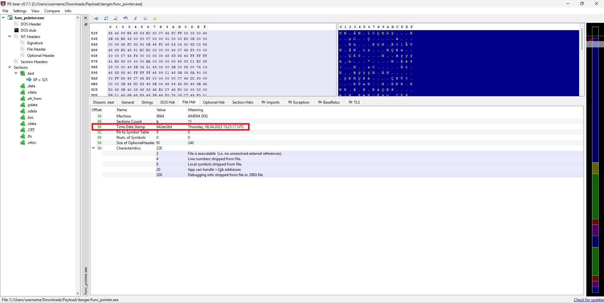

> [+] Answer: 2023-04-06 15:21:17

4. Is ASLR enabled? (True or False)

To check if ASLR is enabled, we must confirm that the IMAGE_DLLCHARACTERISTIC_DYNAMIC_BASE (0x0040) flag is set.

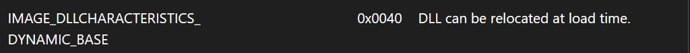

Navigating to the Optional Hdr tab and going to the DLL Characteristics field only shows us that the IMAGE_DLLCHARACTERISTICS_NX_COMPAT (0x0100) flag is set. No dynamic base flag means ASLR has likely been disabled during linking, probably because the binary was built without the --dynamicbase option.

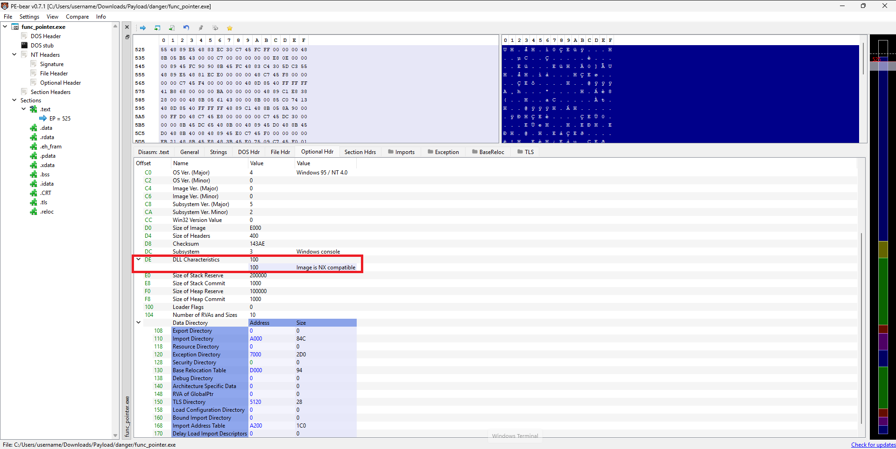

> [+] Answer: False

5. What is the image base address?

The Image Base field under Optional Hdr shows the base image address.

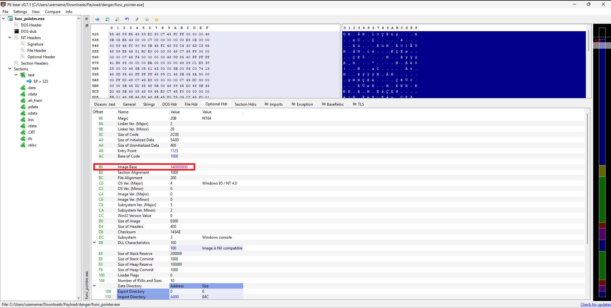

> [+] Answer: 0x140000000

6. What is the entry point?

The entry point is also in the Optional Hdr under the Entry Point field.

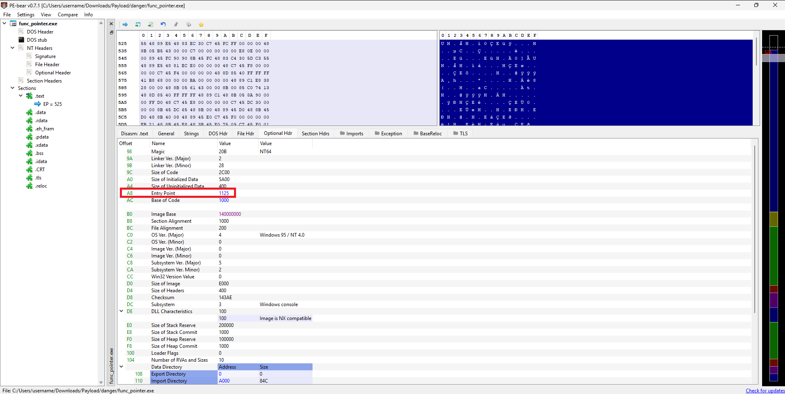

> [+] Answer: 0x1125

7. What are the first 8 bytes of the encrypted payload that is being moved to allocated memory? (format: daffd563616c632e)

Now it's time to run the PE in Ghidra and continue our static analysis. After following the program to its identified entry point, we find a standard startup / initialization function at `FUN_140001154`. `FUN_140001d97` is called here, and it is this function that houses the malware's main logic.
We can see that a 336-byte buffer (0x150) is prepared, then it searches for a running explorer process, dynamically resolves the `OpenProcess` and `CloseHandle` API calls from Kernel32, and finally, tries to get a handle to the explorer process.

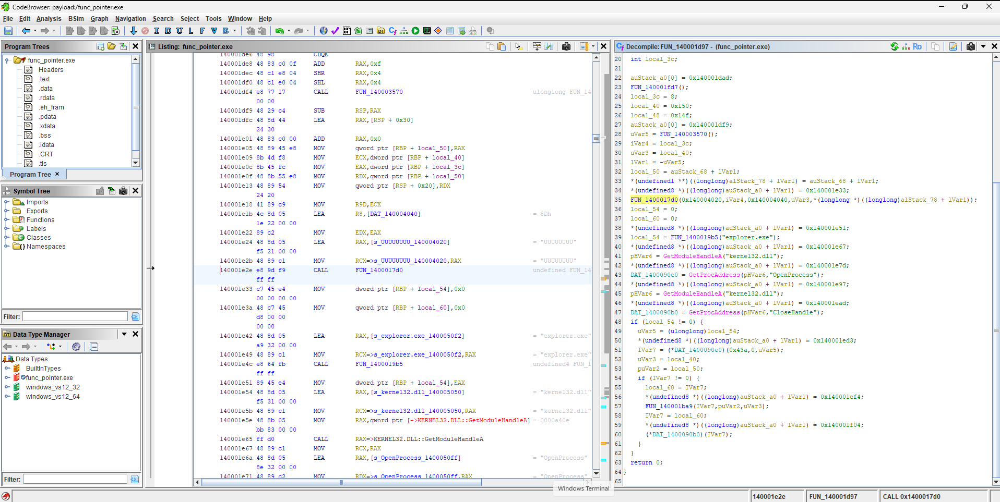

Before attempting to find the explorer process, FUN_1400017d0 is called. The arguments passed to it are very interesting:
```FUN_1400017d0(0x140004020, iVar4, 0x140004040, uVar3, *(longlong *)((longlong)alStack_78 + lVar1))```
uVar3 is equal to the local_40 variable, which was the 336-byte (0x150-byte) buffer prepared earlier. The last argument is likely a pointer to another buffer, 1Var1 seems to be an offset to the stack frame at that point in execution. Let's dive further into that function.

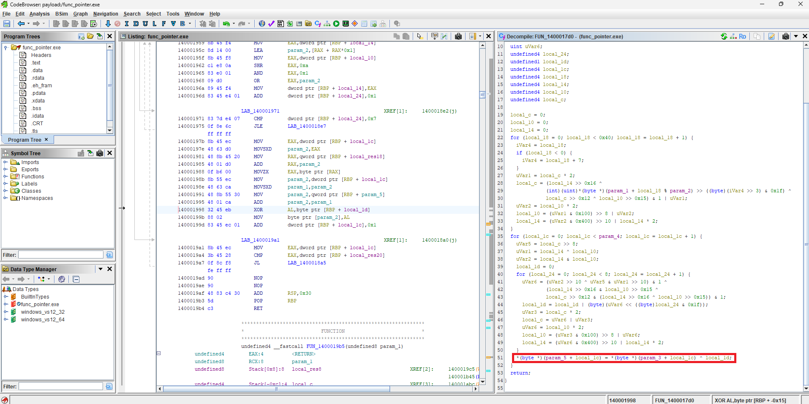

Function `FUN_1400017d0` is a stream cipher in which three internal state registers are seeded using an 8-byte key embedded in the binary. The cipher then generates a pseudo-random keystream one byte at a time, using an XOR operation on each keystream byte with what is probably the encrypted payload to produce the decrypted output buffer. We can now make a pretty good guess as to what the parameters of this function are:
```
void xor_stream_cipher(
    uint8_t *key,      // param_1 (pointer to the key)
    int keyLen,        // param_2 (key length)
    uint8_t *input,    // param_3 (pointer to the source buffer)
    int length,        // param_4 (number of bytes to decrypt/encrypt)
    uint8_t *output    // param_5 (pointer to the destination buffer)
);
```

The source buffer passed to the stream cipher function was 0x140004040, and it is here that we can find the encrypted blob. 

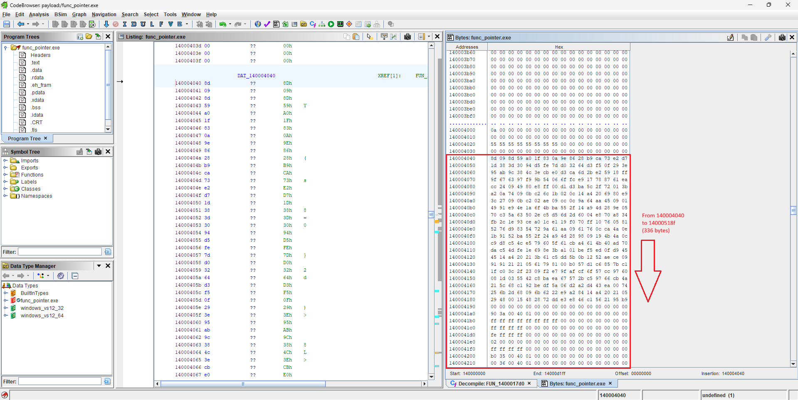

> [+] Answer: 8d098d59a01f830a

8. What is the key for decryption in hex?

Based on our previous findings, the key used for decryption should be found passed to the XOR stream cipher as the first argument (0x140004020). Navigating to that memory address, we find our key!

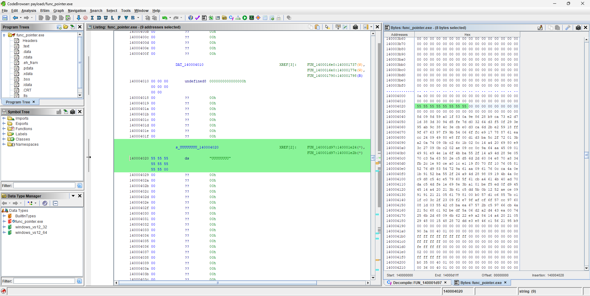

Ghidra displays it as the C string "UUUUUUUU" in the listing, but in the byte display window we can see that in hex; 0x5555555555555555.

> [+] Answer: 0x5555555555555555

9. What is the address of the decrypted payload?

To identify where the decrypted payload is stored, we need to track the destination buffer passed to `FUN_1400017d0`. The fifth parameter points to a stack-based buffer initialized earlier. Ghidra represents this buffer using the expression *(longlong *)((longlong)alStack_78 + lVar1), where lVar1 acts as an offset into the current stack frame. The easiest way to proceed is to open a debugger for dynamic analysis. I chose to use x64dbg. After opening the PE in x64dbg, I used the symbols tab to set a breakpoint at the entry point. From there, I searched for the known decryption key "UUUUUUUU" with the find strings feature (this will show us right where the key is moved into the RAX register before the decryption call). After setting a breakpoint immediately following the call to `FUN_1400017d0` and continuing execution until it was hit, I inspected the stack.

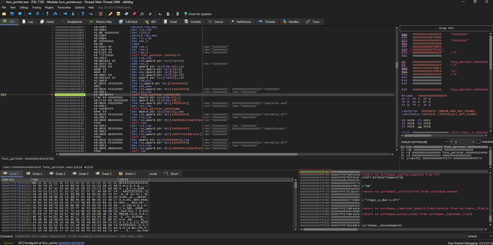

We can see the location of the decrypted payload both in the stack pane and in the updated stack pointer.

> [+] Answer: 0x5FFC40

10. What are the first 8 bytes of the decrypted payload that is being moved to allocated memory? (format: daffd563616c632e)

For this part, we have to find the point in execution when the payload has been fully decrypted before following the previous address in the memory dump. Upon further analysis, I found that function `FUN_1400019b5` is a remote process injection routine. It injects the decrypted buffer from the XOR function into explorer.exe and executes it as shellcode.

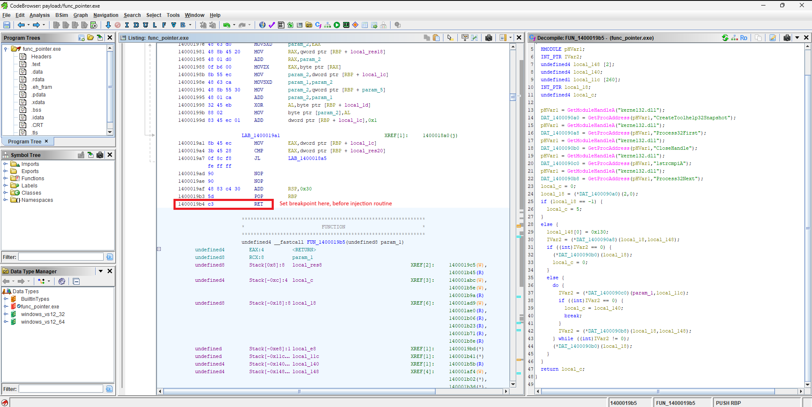

At this point (right before `FUN_1400019b5` is called) the payload has to be decrypted, since it's being injected into explorer.exe for execution. I set a breakpoint at the return instruction right before the function is called and then followed the previous address in the memory dump.

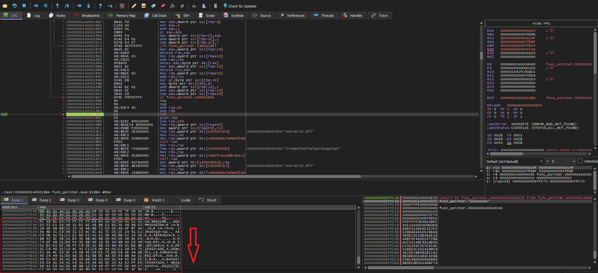

Looking at the dump, since we added 30 to the stack pointer right before the return instruction, (add rsp,30 = 0x5FFC40 + 0x30 = 0x5FFC70) we can see the full decrypted payload starting at 0x5FFC70 (FC 48 81..)

> [+] Answer: fc4881e4f0ffffff

11. There are several functions that are not in the import table but are invoked. Which of these functions starts with V?

This task is much simpler. Since we've already identified a remote process injection routine, we can assume that VirtualAllocEx is used to allocate memory in the explorer process for our 336 bytes of shellcode. To be sure, let's search for strings in Ghidra and then filter.

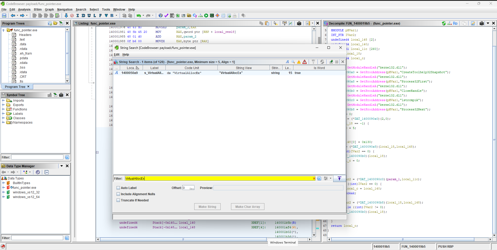

> [+] Answer: VirtualAllocEx

## Lessons Learned

- Much can be gathered just by viewing the information contained in the PE headers
- Compiler-generated startup and initialization code can cause the actual entry point to differ from the entry point field in the optional header
- Looking closely at the arguments passed to a function can enable you to attain that function's logic without deeper immediate analysis
- Runtime API resolution can help ascertain what the malware is doing
- Following the data as opposed to the control flow can speed up analysis when the sample is obfuscated
- Stream ciphers generate a keystream rather than using the secret encryption key directly
- Combining dynamic analysis with static analysis can save lots of time
- Decompiler output in Ghidra should be checked against the assembly code