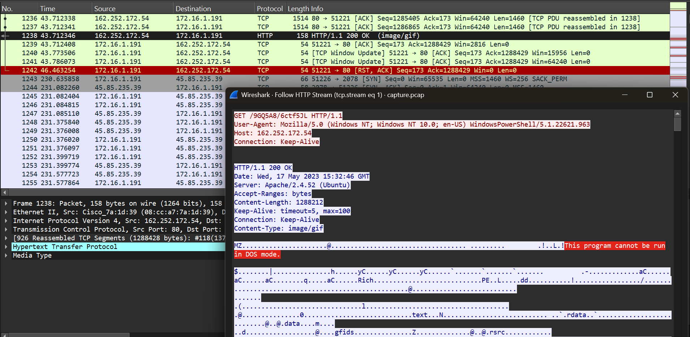
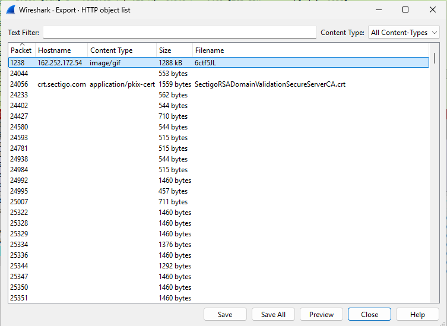
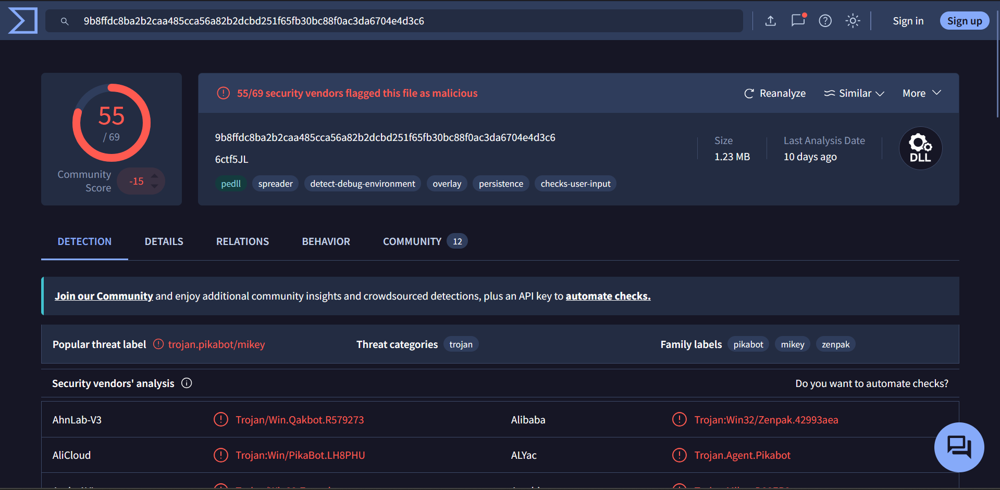
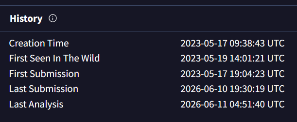
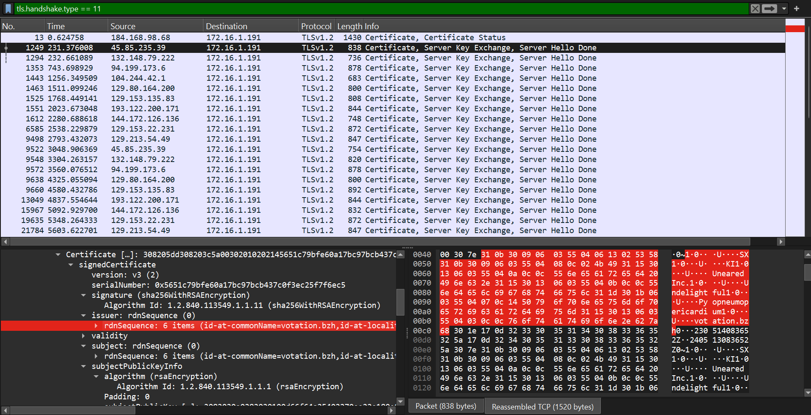
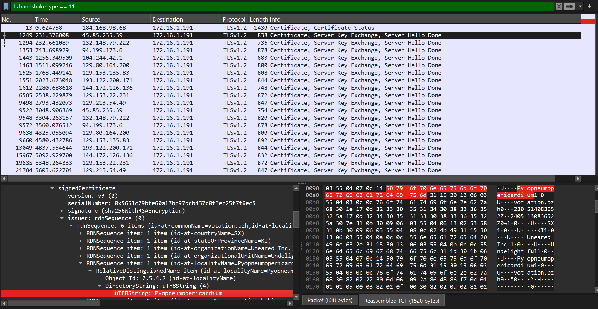
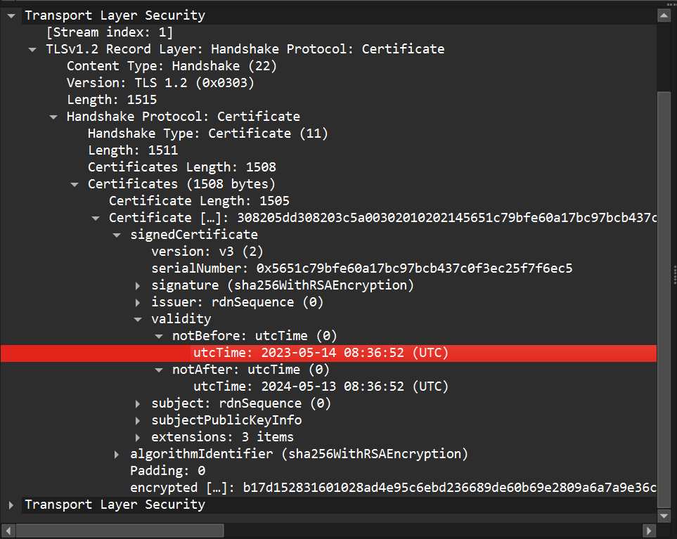
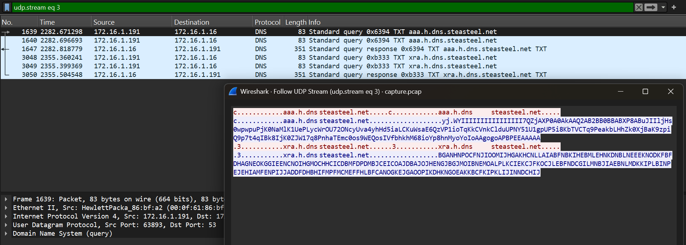

# Compromised

## Overview

- Category: SOC
- Difficulty: Easy
- Author: abdelrhman322
- Completion Date: January 2nd, 2026
- Tags: Wireshark, PCAP, VirusTotal

## Scenario

> Our SOC team detected suspicious activity in Network Traffic, the machine has been compromised and company information that should not have been there has now been stolen – it’s up to you to figure out what has happened and what data has been taken.

## Analysis Environment (Flare VM)

Since this sherlock involved exporting a malicious object from the PCAP file, I used a Windows 11 Flare VM in VirtualBox (set to a host-only adapter) alongside my standard Windows 11 host machine. This was most likely unnecessary, but I wanted to minimize the risk.

## Tasks

1. What is the IP address used for initial access?

We are given a PCAP file. Inspecting this capture in Wireshark, we filter for HTTP traffic and start inspecting the data streams. It quickly became clear that the IP address in question is 192.252.172.54, especially since we can see in the HTTP stream that this server is hosting a suspicious file, which the infected host then used Powershell to download.



The response header indicates that the Content-Type is image/gif, yet the response body begins with the MZ magic number for a PE file. Very suspicious.

[+] ANSWER: >192.252.172.54

2. What is the SHA256 hash of the malware?

It's important at this point to switch to a safe virtual machine environment to prevent accidental detonation. I chose to boot up my Windows 11 Flare VM.

To get the file hash, first we will get the file itself. in Wireshark, I went to File, Export Objects, and then HTTP. In the HTTP object list, we see the suspicious file we caught in the GET request earlier. It's far larger than any other item in the list.



In a powershell terminal, we use the following command to get the hash:
```Get-FileHash .\6ctf5JL -Algorithm SHA256```

[+] ANSWER: >9B8FFDC8BA2B2CAA485CCA56A82B2DCBD251F65FB30BC88F0AC3DA6704E4D3C6

3. What is the Family label of the malware?

Now that we have the SHA256 hash, we can switch back to our host machine and plug that into VirusTotal to get more information.



This does not look good for our infected machine... A fair amount of the security vendor results as well as the Family label suggests that this is a Pikabot sample.

[+] ANSWER: >Pikabot

4. When was the malware first seen in the wild (UTC)?

In the Details section of the VirusTotal results, we can see the detection history.



[+] ANSWER: >2023-05-19 14:01:21

5. The malware used HTTPS traffic with a self-signed certificate. What are the ports, from smallest to largest?

There are multiple methods we can use to look for certificates. I chose to filter for TLS certificate exchanges in Wireshark with:
`tls.handshake.type == 11`
Then, we compare the Issuer and Subject fields. If it's self-signed, they should match. I repeated this process until I reached the end of the filtered packets. The use of unusual ports made this easier.



[+] ANSWER: >2078, 2222, 32999

6. What is the id-at-localityName of the self-signed certificate associated with the first malicious IP?

To find the id-at-localityName, we can use the same filter as before and go to the first self-signed certificate.



[+] ANSWER: >Pyopneumopericardium

7. What is the notBefore time(UTC) for this self-signed certificate?

In the same certificate as before, all we have to do is navigate to validity.



[+] ANSWER: >2023-05-14 08:36:52

8. What was the domain used for tunneling?

Filtering by DNS, there were clear signs of DNS tunneling. By following the UDP stream of the first suspected instance, it shows unusually long DNS labels that look encoded. All of the streams that looked similar were querying the same domain (steasteel.net) with different subdomains.



[+] ANSWER: >steasteel.net

## Lessons Learned

- Content-Type headers can be deceptive. When in doubt, check the file header in the data stream as opposed to trusting the metadata by itself.
- Self-signed certificates can be an IoC in the right context.
- Traffic on non-standard network ports should raise an eyebrow.
- DNS tunneling is very "loud", especially when it's being used bidirectionally for C2 communications.
